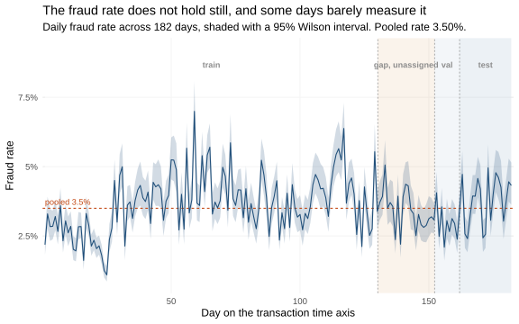
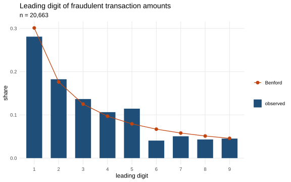
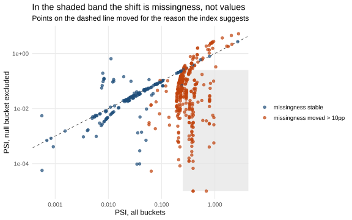
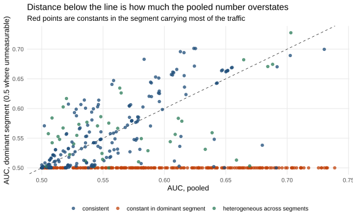

# IEEE-CIS feature audits

Which columns of the [IEEE-CIS](https://www.kaggle.com/c/ieee-fraud-detection) fraud
dataset a model can be allowed to see, decided as statistics rather than as opinions.
Every verdict is a rank statistic, a weight-of-evidence table or a two-sample test, so a
rejection reads as a sentence about a bin instead of as the output of a fit.

R only, and self-contained: two CSVs from Kaggle, `renv::restore()`, and the audits run.
No cloud account, no warehouse, no orchestrator, no Python.

**Who this is for.** A data scientist or statistician who wants to see how these columns
actually behave, and a model-validation or compliance reader who wants to see how a
rejection was justified. Every notebook answers one question and prints the interval
behind the answer.

## Two phases, and why they are two repositories

Analysis is ad-hoc and a person drives it: nobody automates the decision *this column
reversed its meaning between windows*. Modelling is automated, because it repeats on every
retrain. The boundary between them is a contract — a specification that the analysis signs
and the pipeline executes. It is the same line that in practice runs between an analytics
team and a platform team.

| | Decides | Mode | Output |
| --- | --- | --- | --- |
| **this repository** | what is true of the data | ad-hoc, human | `feature-contract.json` |
| [`fraud-detection-mlops`](https://github.com/jjabuk/fraud-detection-mlops) | what is done with a model | automated, repeatable | a trained, gated, promoted model |

Nothing here trains a production model, and nothing downstream recomputes a verdict. The
pipeline stamps a fingerprint of the contract onto every model it trains and refuses to
score when the file it reads disagrees — so the verdicts below are not advisory.

```
audit frame (features.model_input, derivations applied)
   -> notebooks/*.qmd        one question each, each writing a fragment
   -> out/fragments/*.json   verdicts plus the evidence behind them
   -> out/tables/*.csv       the full report a person reads to look up a column
   -> build-contract.qmd     merges fragments; computes nothing
   -> out/declaration.json   the column list, its sources and dtypes
   -> [cut] the pipeline repository stamps the fingerprint, trains, gates, scores
```

## The data

590,540 e-commerce transactions, of which 3.5% are fraudulent (Wilson 95% interval:
[3.48%, 3.56%]). The time axis spans roughly six months.

<p align="center">
  
</p>

*Daily fraud rate with 95% Wilson confidence bands; the dashed line is the pooled rate. The
rate moves visibly across the period — the structural break test finds two level shifts,
neither of which falls where the audit windows are cut. Computed by
[why-the-validation-gap-is-not-a-mistake](notebooks/why-the-validation-gap-is-not-a-mistake.qmd).*

Two caveats about the time axis apply to everything below. The windows are quantiles of the
time value, so they hold **equal numbers of rows and unequal amounts of calendar** — 22.6
days early against 35.1 days late — and part of what reads as a feature changing is the
later window having watched for longer. The time column is never given to the joint
two-sample test, because the periods are defined by it and any discriminator handed that
column scores a perfect AUC without finding anything about the data.

## The audits

Three things a verdict can do to the contract, and the same three marks are used
in every table on this page:

| | |
| :---: | --- |
| ✅ | **Rejects.** A verdict here can remove a column from the feature set, or fix the entity key. |
| 📊 | **Recorded.** Written into the contract as evidence, and never removes anything. |
| ➖ | **Descriptive.** Never reaches the contract at all. |

| Notebook | Question | Method | |
| --- | --- | --- | :---: |
| `does-a-feature-still-mean-the-same-later` | Has a column reversed between an early and a late window? | Weight of evidence, Somers' D, DeLong intervals and test | ✅ |
| `has-the-population-moved` | Did the distribution move, and are the periods distinguishable jointly? | PSI against a measured null, Anderson–Darling, energy test | ✅ |
| `which-columns-say-the-same-thing-twice` | Which columns restate their neighbours? | Variable clustering on rank correlation, redundancy analysis on splines | ✅ |
| `who-is-the-customer-when-the-data-does-not-say` | Is the reconstructed entity real, and which key? | Label purity against a permuted null, coverage, concentration | ✅ |
| `does-a-column-work-inside-every-segment` | Does a pooled association survive conditioning on the product? | Cochran–Mantel–Haenszel, Breslow–Day | 📊 |
| `what-the-columns-are-made-of` | Does a column know more about the period than about fraud; how many dimensions does a V block have; is absence random? | Cramér's V with a bootstrap interval, Horn's parallel analysis, tetrachoric correlation, Little's MCAR | 📊 |
| `what-the-fraud-literature-asks…` | What is true of the phenomenon rather than of a column? | Benford, power-law tail index, Bai–Perron breaks, Rayleigh, Gini/HHI | ➖ |
| `what-does-this-data-look-like` | How much fraud, where, and are the columns the type they claim? | Wilson intervals on every rate, weight of evidence on the amount, cardinality against declared type | ➖ |

`build-contract.qmd` merges the fragments, and asks two questions about the result
itself: whether the admitted set carries more information value than random sets of the
same size, and how much of it survives moving the drift threshold.

No audit trains a model. Where the literature reaches for one — a single-feature
fit to score a column, a classifier to tell two periods apart — a ten-bin
scorecard and a permutation two-sample test answer the same question and print.

## What the audits found

**[Time consistency](notebooks/does-a-feature-still-mean-the-same-later.qmd).** A feature that
separates fraud one way early and the other way late has not found a weak signal — it has
found a pattern that belongs to the past. A WoE scorecard is fitted on the early window and
applied unchanged to the late one, then the AUC of each is plotted against the other, one
point per column: the shaded quadrant, signal early and reversed late, is the finding.
`V150` is the clearest case — its two upper bins became empty in the later window and the
WoE of the surviving bin changed sign, from −0.30 to +0.49. The column did not merely
weaken; its populated range collapsed and the odds attached to what survived reversed.

<p align="center">
  
</p>

**[Distribution shift](notebooks/has-the-population-moved.qmd).** The same two windows, asking
about a column's own distribution rather than its relationship to the label. Of 499
measurable columns every single one moves detectably and 200 move materially — the two-key
rule visible inside one audit. It also separates two things a single index conflates: `M7`,
`M8` and `M9` post among the largest indices in the scan, and almost none of it is about
their values. Each went from 84% missing to 39% missing between the windows, and with the
empty bucket excluded their distributions are unchanged (0.0006 to 0.0047). A column that
*started being collected* looks exactly like a column that broke.

<p align="center">
  
</p>

**[Redundancy](notebooks/which-columns-say-the-same-thing-twice.qmd).** Correlation names a
pair; redundancy names the one to drop. Of the columns strongly correlated with a group-mate,
only a fraction are actually *reconstructable* from that group — the rest correlate strongly
and still carry something nothing else does. The partition's sensitivity to its own threshold
is checked below: it responds smoothly on both sides, so the policy setting is not perched on
a cliff edge. Horn's parallel analysis adds the second angle — across the pinned V-blocks the
compression ratio runs 4× to 11×, and `V143–V166` is eleven columns carrying one component
with 94% of the variance, so keeping one representative per block is far less lossy than it
looked.

<p align="center">
  
</p>

**[Segment qualification](notebooks/does-a-column-work-inside-every-segment.qmd).** A column can
separate fraud across the whole table and separate nothing inside every product segment — in
which case it predicts *which segment a row is in*, not fraud. Several columns reach pooled
AUC as high as 0.70 and are constants inside the segment carrying most of the traffic. The
fragment records this without rejecting, because between-segment signal is genuinely
predictive here: the segment predicts the outcome.

<p align="center">
  
</p>

**[Entity reconstruction](notebooks/who-is-the-customer-when-the-data-does-not-say.qmd).** The
dataset names no customer, and everything downstream needs one. Purity alone says nothing at
a 3.5% base rate — a group of two rows is homogeneous 93% of the time by chance — so what is
measured is the lift over a permuted null. It runs the other way from raw purity: each
component added buys less than the one before, because each also shatters groups into
singletons. Adding `card2` buys nothing (lift 0.0403 against 0.0405) while costing coverage.
Roughly half the table has no usable history at prediction time, which is why the pipeline's
cold-entity check is not an edge case but most of the traffic.

<p align="center">
  
</p>

**[Forensic checks](notebooks/what-the-fraud-literature-asks-that-the-columns-do-not.qmd).**
Five classical tests that no per-column scan reaches. None feeds the contract; all describe
what is being modelled. The amounts are *close* to Benford —
[the leading-digit plot](docs/img/benford-plot.svg) shows the chi-square rejecting conformity
overwhelmingly while the effect size stays marginal, which is what 20,000 observations do to
a p-value. [Bai–Perron](docs/img/bai-perron-breakpoints.svg) finds two level shifts in the
daily rate, neither where the audit windows are cut, so a drift monitor pinned to that
convention would report late. And [fraud rate by hour](docs/img/circular-fraud-rate.svg),
plotted on the circle rather than the line, shows a cycle Rayleigh rejects uniformity against
strongly — but `TransactionDT` is seconds from an unpublished origin, so the cycle can be
modelled and the hour cannot be named.

## Every statistic, and what it decides

Each row is a test or an interval, not a threshold on a point estimate. The mark
in the last column is the legend above: ✅ can reject, 📊 recorded as evidence,
➖ descriptive only.

| Question | Method | R | |
| --- | --- | --- | :---: |
| Does a column carry signal at all? | Somers' D, identical to AUC on the Mann–Whitney scale | `Hmisc::somers2` | ✅ |
| Is that signal distinguishable from none? | AUC with a DeLong confidence interval | `pROC::ci.auc` | ✅ |
| Did it change between an early and a late window? | DeLong's test for two AUCs, unpaired | `pROC::roc.test` | ✅ |
| Did it reverse direction? | Sign flips in the weight of evidence per bin, weighted by the mass they carry | own, on a pinned binning | ✅ |
| Did the column's distribution move? | PSI against its **measured** null, drawn from the multivariate hypergeometric | own | ✅ |
| Is the move more than sampling noise? | Anderson–Darling and Cramér–von Mises, permutation p-values | `twosamples` | ✅ |
| Which columns restate their neighbours? | Variable clustering on rank correlation, cut on shared variance | `stats::hclust` on Spearman ρ² | ✅ |
| Which are *reconstructable* from the others? | Redundancy analysis on restricted cubic splines | `Hmisc::redun` | ✅ |
| Is the reconstructed customer real? | Label purity against a permuted null that keeps the group sizes | own | ✅ |
| How much information does it carry? | Information value over the same bins | own | 📊 |
| Are the two periods distinguishable **jointly**? | Energy two-sample test — adversarial validation without the adversary | `energy::eqdist.etest` | 📊 |
| How strong is a categorical dependence, and how precisely known? | Cramér's V with Bergsma's correction, bootstrapped on the contingency table | `DescTools`, own | 📊 |
| How many dimensions does a block of V columns really have? | Horn's parallel analysis | `psych::fa.parallel` | 📊 |
| Are the binary M columns one latent thing? | Tetrachoric correlation | `psych::tetrachoric` | 📊 |
| Does an association survive conditioning on the product segment? | Cochran–Mantel–Haenszel | `stats::mantelhaen.test` | 📊 |
| Is it the *same* association in every segment? | Breslow–Day test for homogeneity of odds ratios | `DescTools::BreslowDayTest` | 📊 |
| Is a value missing at random? | Little's MCAR test, against always-observed columns | `naniar::mcar_test` | 📊 |
| Do the amounts look naturally generated? | Benford's law, with the effect size next to the p-value | `benford.analysis` | ➖ |
| How heavy is the tail of the losses? | Power-law tail index, Clauset–Shalizi–Newman | `poweRlaw` | ➖ |
| When did the fraud rate actually change? | Bai–Perron structural breaks | `strucchange::breakpoints` | ➖ |
| Is there a daily cycle? | Rayleigh's test — hour of day is circular, not linear | `circular::rayleigh.test` | ➖ |
| How concentrated is the customer base? | Gini and Herfindahl–Hirschman on transactions per entity | `ineq` | ➖ |

### The descriptive pass

What is in front of the audits, rather than whether a column can be trusted.
Nothing here touches the contract.

| Question | Method | |
| --- | --- | :---: |
| How much fraud is there, and does the rate hold still? | Wilson intervals on the daily rate | ➖ |
| Where does the fraud sit? | Fraud rate per product and per device-info presence, with non-overlapping Wilson intervals | ➖ |
| Does rarity predict fraud? | Fraud rate by frequency band, against each column's own base rate | ➖ |
| What does the amount say on its own? | Weight of evidence and information value over the amount | ➖ |
| Are the columns the type they claim? | Stored type against effective cardinality | ➖ |

## Why not a model

Fitting a single-feature model per column and reading its AUC answers the
question, at three costs: the direction it learned is not recoverable, a
rejection cannot be explained to whoever approves the feature set, and the
verdict depends on hyperparameters that have nothing to do with the data.

Binning plus weight of evidence is also a learned, possibly non-monotone mapping
from values to a fraud ordering — and it prints as eleven rows. The AUC of a
WoE-scored window is exactly the Mann–Whitney statistic, so nothing is given up
in precision.

## Two keys, both required

At 100,000 rows per window almost any difference is statistically significant.
Every rejection therefore needs both:

- **Significance** — a DeLong confidence interval that excludes 0.5, and a
  p-value surviving Benjamini–Hochberg across the whole scan. Without the
  correction, 377 tests at a nominal 5% produce roughly nineteen rejections by
  chance alone.
- **Materiality** — a drop in Gini that clears a stated threshold. Significance
  alone would reject most of the table for movements nobody would act on.

## Running it

```bash
Rscript -e 'renv::restore()'                # once: the pinned library
Rscript scripts/fetch-kaggle-data.R         # once: the two competition CSVs
Rscript scripts/build-audit-frame.R         # join, derivations, fitted maps
Rscript -e 'targets::tar_make()'            # the audit graph
Rscript -e 'targets::tar_visnetwork()'      # draw it
quarto render notebooks/                    # the readable version
quarto render build-contract.qmd            # the merge
Rscript tests/run.R                         # the suite, exactly as CI runs it
```

`renv.lock` pins 117 packages to the versions these results were produced under, resolved
against R 4.5.1, and `.Rprofile` activates the project library automatically. The
interpreter version is pinned in CI too: a lockfile records packages and not the R they
were resolved against, so leaving that floating would let a new release change a verdict
while the lockfile still claimed reproducibility.

Every test here is synthetic — no parquet, no warehouse, no credential — which is what
lets the statistics be checked on a pull request rather than only on a machine that has
the dataset.

`targets` is to this package what Dagster is to the pipeline: a dependency graph
with content-addressed invalidation. The two are deliberately not wired
together — the contract file is the only thing they share.

The graph and the notebooks both write fragments, and they must write the *same*
fragment: a fragment carries the policy that produced it, so two definitions of a
threshold would produce two contracts differing for a reason that says nothing about
the data, and whichever ran last would win. Every threshold therefore lives in
`R/policy.R` and nowhere else. A number appearing in a notebook and not in that file
is a bug, not a local override.

`load_windows` sorts every window on the time axis before returning it, and that is
load-bearing rather than tidy. A filtered Arrow scan is multi-threaded and does not
promise file order, so two runs get the same rows in a different sequence — invisible
to anything that reads every row, and fatal to anything that subsamples, because a
seeded `sample.int` then picks the same positions out of a different ordering. "Seeded"
and "reproducible" are not the same claim.

## The input

The audits read one file: the frame *as the model receives it*, which means with the
declared derivations already applied. Auditing the raw Kaggle export instead would leave
thirty derived columns unexamined, and eight of them were rejected the last time the whole
set was measured.

`scripts/build-audit-frame.R` builds it here, from the two competition CSVs: the left join,
the V-block null count computed on the raw nulls, the frequency maps fitted on the training
split, and all thirty declared derivations applied. It writes
`data/audit_frame.parquet`, which is where `_targets.R` looks by default. Nothing under
`data/` is committed — the competition terms do not allow redistributing the dataset.

**What a standalone build does not carry.** The pipeline's frame also holds ~40 *entity
aggregates* — a card's transaction count in the last hour, a client's mean amount over its
prior rows — computed by BigQuery window functions under `RANGE … 1 PRECEDING`. Those are
deliberately not reimplemented here: they are the pipeline's point-in-time guarantee,
asserted by its own tests against the SQL it generates, and a second implementation of a
guarantee is a second thing that can be wrong about it. To put verdicts on those columns
too, export a frame from the pipeline repository and point `FRAUDAUDIT_PARQUET` at it. The
contract records which mode produced it, so a reader can tell which columns were examined.

## What leaves here

The contract, and it is a specification rather than a report. Besides the verdicts it
carries two blocks the pipeline executes:

- **`derivations`** — how each derived column is computed: `name`, `tool`, `inputs`,
  `params`. Three tools cover all thirty. The pipeline renders each entry into the SQL or
  dataframe operation it needs; it does not keep its own copy of the list, which is what
  makes the boundary point one way.
- **`fitted_parameters`** — what the fitted derivations learned. Today that is the
  frequency-encoding counts, fitted on the training split only, with rare levels dropped so
  an unseen value encodes as missing rather than as a count of one.

Both fall under the contract's fingerprint. That is the point of putting them here: a
fitted mapping that can move without invalidating the pin is the half of the specification
nobody notices changing, and the pipeline stamps this fingerprint onto every model it
trains.

## Layout

| | |
| --- | --- |
| `R/io.R` | window cutting, including the quantile convention the migration turned on |
| `R/binning.R` | pinned bins, shared with the drift audit so PSI and WoE compare like with like |
| `R/woe.R` | weight of evidence, information value, and the reversal statistics |
| `R/association.R` | Somers' D, DeLong intervals, the two-sample AUC test, BH |
| `R/time_consistency.R` | the audit and its two verdicts |
| `R/distribution_shift.R` | PSI, its null distribution, marginal and multivariate tests |
| `R/redundancy.R` | rank-correlation clustering, redundancy analysis, block audit |
| `R/segment_qualification.R` | risk dichotomy, CMH, Breslow–Day |
| `R/categorical.R` | Cramér's V, bootstrapped on the contingency table |
| `R/missingness.R` | missingness families, Little's MCAR against always-observed columns |
| `R/dimensionality.R` | parallel analysis, tetrachoric correlation |
| `R/entity.R` | entity keys, purity against a permuted null |
| `R/policy.R` | every threshold, defined once for the graph and the notebooks alike |
| `R/contract.R` | the merge, and nothing else |
| `R/fragments.R` | what leaves the package, and the V-block expansion |
| `R/derivations.R` | the three derivation tools and the thirty declarations that drive them |
| `R/frequency_maps.R` | fitting the count tables on the training split |
| `R/frame.R` | the join, the V-block null count, and the two input modes |
| `R/kaggle.R` | fetching the competition data; the only code here that reaches outside the process |
| `scripts/` | the two commands a fresh clone runs, in order |

## Open items

**Nothing checks that the two implementations of a tool agree.** `days_since_to_start_day`
now exists here and in the pipeline, which is the cost of the split. The cheap guard is a
small committed fixture — a dozen input rows and their expected outputs, generated here —
that the pipeline's test suite reads and checks its own implementation against. Worth doing
before either side changes a tool.

**A standalone build cannot audit the entity aggregates.** Explained under
[The input](#the-input); it is a stated limit rather than a bug, but it means the contract
produced by a standalone run carries verdicts on ~460 of 502 columns and says so.

**The rendered notebooks are not published.** They are gitignored, because committing
1.5 MB of self-contained HTML per notebook puts the output of a run into the diff of every
change to it. A reader who will not install R therefore cannot see any of the results,
which is the wrong trade for the audience this repository is written for: they belong on
GitHub Pages, built by CI.
